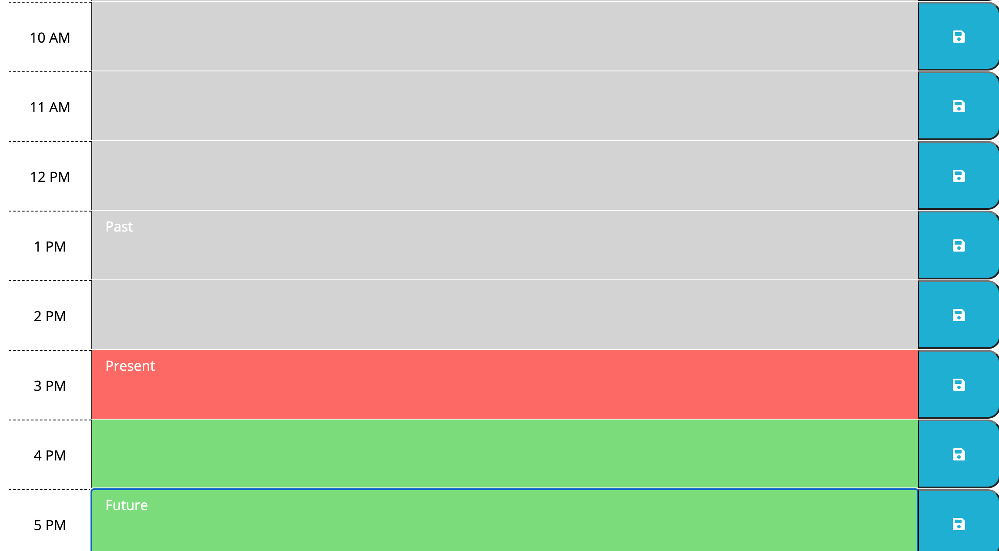
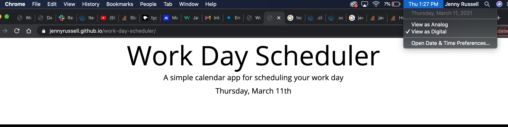

# Project Title:

Work Day Scheduler

# Description

This application is a work-day schedule. It works in the work-day hours of 9 am to 5pm. Hour blocks are color coded based on when they take place. Current hour block is red, past is grey, and future is green. Current day is displayed on the jumbortron. User is able to add content to the scheuder that is saved to local storage and persists on page reload.

# URL

https://jennyrussell.github.io/work-day-scheduler/

# Images

# License

MIT 